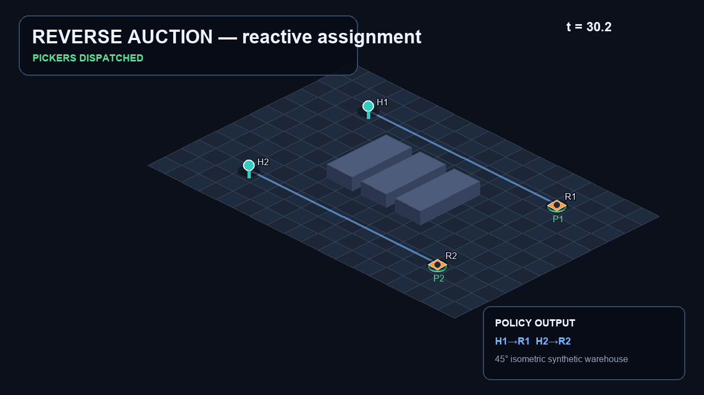

# Reverse-Auction Order Picking

Executable research code for **global human-to-robot assignment in collaborative order-picking systems**. This repository contains the actual warehouse simulator integration—not a standalone pseudocode translation or a paper file listing.

The implementation extends [RWARE](https://github.com/semitable/robotic-warehouse) with human pickers, robot requests, obstacle-aware travel costs, deterministic Bertsekas-style auction matching, and guarded re-auction.

[](media/reverse_auction_demo.mp4)

[Watch or download the Reverse Auction MP4](media/reverse_auction_demo.mp4)

The six-second synthetic rollout uses the repository's actual cost-matrix builder and Bertsekas auction solver. Robots first travel to their pick locations; the reactive reverse auction dispatches H1/H2 after the robot-arrival gate. The 45-degree isometric geometry is synthetic and contains no private warehouse data.

Reproduce it with:

```bash
python scripts/render_synthetic_warehouse.py \
  --method auction \
  --output media/reverse_auction_demo.mp4 \
  --poster media/reverse_auction_poster.png
```

## What you can run

After cloning, you can:

1. inspect the exact bid-cost construction used by the simulator;
2. compare auction matching with a greedy solver on the same value matrix;
3. instantiate the synthetic RWARE map used by the contract tests;
4. run the assignment, map-DSL, and engine-enforcement tests without private data.

## Quick start

Python 3.10–3.13 is supported.

```bash
git clone https://github.com/Godpa-juke/reverse-auction-order-picking.git
cd reverse-auction-order-picking
python -m venv .venv
source .venv/bin/activate
python -m pip install -e '.[dev]'
python scripts/run_synthetic_assignment.py
pytest
```

The example prints a real cost matrix produced by `AuctionAssignmentStrategy` and the robot index selected for each human by both auction and greedy solvers. It is deterministic and needs no warehouse dataset.

## Method implemented here

For each candidate human `h` and robot request `r`, the simulator builds a cost containing:

- obstacle-aware human travel distance;
- estimated robot service time;
- robot waiting-time urgency;
- human waiting-time fairness;
- an optional out-of-zone penalty.

The solver maximizes the negative cost under one-to-one assignment. Re-auction is guarded by:

- **arrival lock** `tau_lock`: do not switch an assignment near arrival;
- **minimum gain** `delta_gain`: switch only when the cost improvement is material;
- **switch budget** `max_reassign`: cap reassignment count per request.

Ablation strategies keep the same simulator path while independently removing urgency, fairness, service cost, zone handling, re-auction, or the auction solver itself.

## Code map

| Path | Purpose |
|---|---|
| `rware/engine/human_assignment.py` | snapshots, cost matrix, auction/greedy solvers, re-auction guards, strategy registry |
| `rware/engine/warehouse_engine.py` | live simulator integration and assignment refresh |
| `rware/core/map_dsl.py` | synthetic/public map parser and traffic constraints |
| `rware/warehouse.py` | multi-agent warehouse environment |
| `rware/algorithm/path_planning/` | A*, JPS, and modified JPS planners |
| `scripts/run_synthetic_assignment.py` | deterministic no-data assignment example |
| `scripts/render_synthetic_warehouse.py` | actual-policy 45-degree isometric MP4 renderer |
| `tests/test_auction_ablation.py` | solver and cost-term contracts |
| `tests/test_engine_enforcement.py` | inline-map movement constraints |

## Public reproducibility boundary

Included:

- executable simulator and assignment source;
- an inline synthetic warehouse layout;
- deterministic no-data example;
- behavioral tests;
- license, citation, and source provenance.

Not included:

- real warehouse orders or operational records;
- facility-specific maps and precomputed path arrays;
- raw experiment outputs, checkpoints, manuscripts, or internal paths.

The repository therefore supports **algorithm inspection, extension, synthetic execution, and unit-level reproduction**. It does not claim to reproduce private-site throughput numbers from public inputs.

## Tests

```bash
pytest
```

The public test set is intentionally asset-independent. It executes behavior rather than checking source text:

- auction versus greedy assignment;
- exact ablation cost relationships;
- strategy registration and re-auction overrides;
- map-overlay parsing;
- robot/human movement constraints on an inline synthetic map.

## Extending the artifact

New assignment policies implement `HumanAssignmentStrategy` and register through `@register_strategy`. To compare policies fairly, use the shared obstacle-aware distance helpers instead of introducing a policy-specific distance proxy.

## Provenance and license

See [`PROVENANCE.md`](PROVENANCE.md) for the canonical export revision. This project is a modified derivative of RWARE. The upstream MIT copyright and license are preserved in [`LICENSE`](LICENSE).
